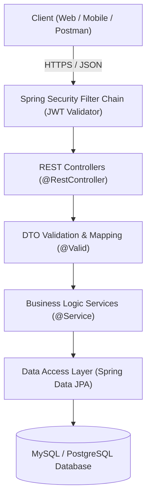

# 🚗 Car Rental Management System (REST API)


Enterprise-ready RESTful backend application for managing vehicle fleets, customer bookings, rental pricing, and role-based permissions. Designed with a clean 3-tier layered architecture, robust data validation, and automated testing.

---

## 📌 Business Overview & Problem Statement

Managing a car rental company requires zero-collision booking reservations, accurate billing calculations, vehicle fleet status tracking (maintenance, rented, available), and strict security boundaries between customers, branch employees, and management.

This system provides:
1. **Accurate Date-Range Reservation Logic:** Prevents double-booking collisions by dynamically validating overlapping rental schedules.
2. **Role-Based Access Control (RBAC):** Distinct permission levels for Customers (manage own profile/rentals), Staff (process pickups/returns, fleet inspection), and Admins (pricing, fleet management, revenue analytics).
3. **Stateless JWT Authentication:** Secure, scalable token-based communication for modern web and mobile frontends.
4. **Standardized API Error Handling:** Unified JSON error formats with detailed validation feedback.

---

## 🏗️ Architecture & Technology Stack

### System Architecture Flow



### Core Technologies:
- **Language & Framework:** Java 17, Spring Boot 3
- **Persistence & ORM:** Spring Data JPA, Hibernate 6, MySQL
- **Security:** Spring Security 6, JWT (JSON Web Tokens)
- **Documentation:** Springdoc OpenAPI 3 / Swagger UI
- **Testing:** JUnit 5, Mockito, AssertJ
- **Build Tool:** Apache Maven

---

## 🚀 Key Features & Modules

### 1. Authentication & Security Module
- User registration and login with encrypted passwords (`BCryptPasswordEncoder`).
- Stateless session management using JWT access tokens.
- Secured endpoint filters based on permissions (`ROLE_CUSTOMER`, `ROLE_EMPLOYEE`, `ROLE_ADMIN`).

### 2. Fleet & Vehicle Management
- Full CRUD operations for cars categorized by brand, model, transmission, fuel type, and body class.
- Vehicle availability status toggle (`AVAILABLE`, `RENTED`, `MAINTENANCE`).
- Dynamic search and multi-criteria filtering (price range, category, location).

### 3. Reservation & Rental Engine
- **Collision-Free Date Validation:** Algorithm checking database for existing overlapping bookings before confirmation.
- Automated daily rate calculation based on rental duration and vehicle category.
- Rental lifecycle transitions: `PENDING` ➔ `CONFIRMED` ➔ `IN_PROGRESS` ➔ `COMPLETED` / `CANCELLED`.

### 4. Global Exception Handling
- Centralized exception management using `@RestControllerAdvice`.
- Meaningful HTTP status codes (`400 Bad Request`, `401 Unauthorized`, `403 Forbidden`, `404 Not Found`, `409 Conflict`).

---

## 📡 REST API Specification

### Authentication Endpoints
| HTTP Method | Endpoint | Description | Access |
|---|---|---|---|
| `POST` | `/api/v1/auth/register` | Register new customer account | Public |
| `POST` | `/api/v1/auth/login` | Authenticate user & return JWT token | Public |

### Vehicles Endpoints
| HTTP Method | Endpoint | Description | Access |
|---|---|---|---|
| `GET` | `/api/v1/cars` | Get list of all cars (supports filters & pagination) | Public |
| `GET` | `/api/v1/cars/{id}` | Get car details by ID | Public |
| `POST` | `/api/v1/cars` | Create new vehicle entry | `ADMIN`, `EMPLOYEE` |
| `PUT` | `/api/v1/cars/{id}` | Update vehicle specifications | `ADMIN`, `EMPLOYEE` |
| `DELETE` | `/api/v1/cars/{id}` | Remove vehicle from fleet | `ADMIN` |

### Bookings & Rentals Endpoints
| HTTP Method | Endpoint | Description | Access |
|---|---|---|---|
| `GET` | `/api/v1/rentals/my-rentals` | Get active user's rental history | `CUSTOMER` |
| `POST` | `/api/v1/rentals` | Create new rental reservation | `CUSTOMER` |
| `PATCH` | `/api/v1/rentals/{id}/status` | Update rental lifecycle status | `EMPLOYEE`, `ADMIN` |
| `GET` | `/api/v1/rentals/admin/all` | View global rental register | `ADMIN` |

---

## 💻 Quickstart & Installation

### Prerequisites
- JDK 17 or higher installed
- Maven 3.8+
- MySQL 8.0+ (or Docker)

### 1. Clone the repository
```bash
git clone https://github.com/PawelJurkiewicz/car-rental.git
cd car-rental
```

### 2. Configure Database
Update `src/main/resources/application.properties` (or `application.yml`):
```properties
spring.datasource.url=jdbc:mysql://localhost:3306/car_rental_db?createDatabaseIfNotExist=true&useSSL=false&serverTimezone=UTC
spring.datasource.username=root
spring.datasource.password=your_password
spring.jpa.hibernate.ddl-auto=update
spring.jpa.show-sql=false
jwt.secret=9a6747f3a778ac7da1e39a7a6952d68f223b8611f206540b9e821db35f12579f
jwt.expiration=86400000
```

### 3. Build and Run
```bash
# Build project
mvn clean package -DskipTests

# Run application
mvn spring-boot:run
```

The application will start on port `8080`.

### 4. Interactive Swagger Documentation
Open your browser and navigate to:
```
http://localhost:8080/swagger-ui/index.html
```

---

## 🧪 Testing

The application includes automated unit and integration tests covering service logic, boundary conditions, and mock repositories.

```bash
# Run all tests
mvn test
```

Test coverage focuses on:
- Booking conflict resolution algorithms.
- JWT token generation and validation.
- Vehicle status transitions.

---

## 🔮 Future Roadmap

- [ ] Docker Compose setup for one-click database and application deployment.
- [ ] Integration with cloud data warehouse (**Google BigQuery**) for fleet utilization and profitability analytics.
- [ ] Automated customer notification agent via **n8n / LLM API** for reservation confirmation and reminders.

---

## 👤 Author

**Paweł Jurkiewicz**  
- LinkedIn: [linkedin.com/in/pawel-jurkiewicz](https://www.linkedin.com/in/pawel-jurkiewicz)  
- GitHub: [@PawelJurkiewicz](https://github.com/PawelJurkiewicz)  
- Email: pablo.jurkiewicz.vip@gmail.com
